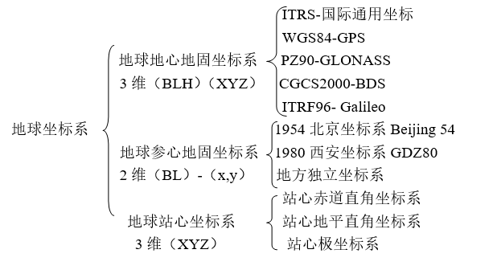
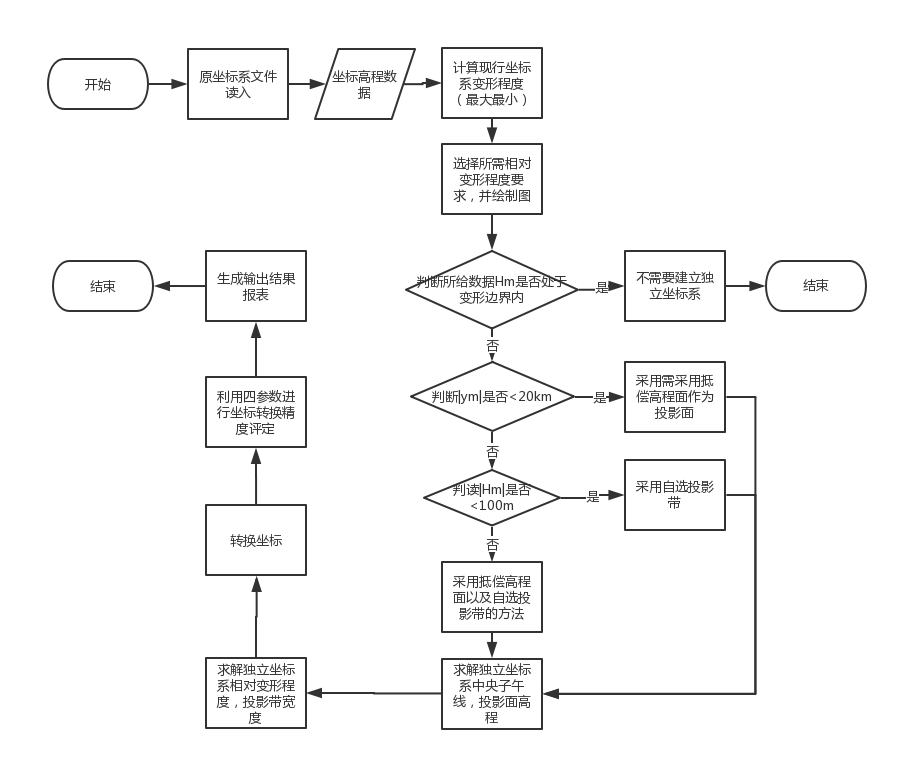
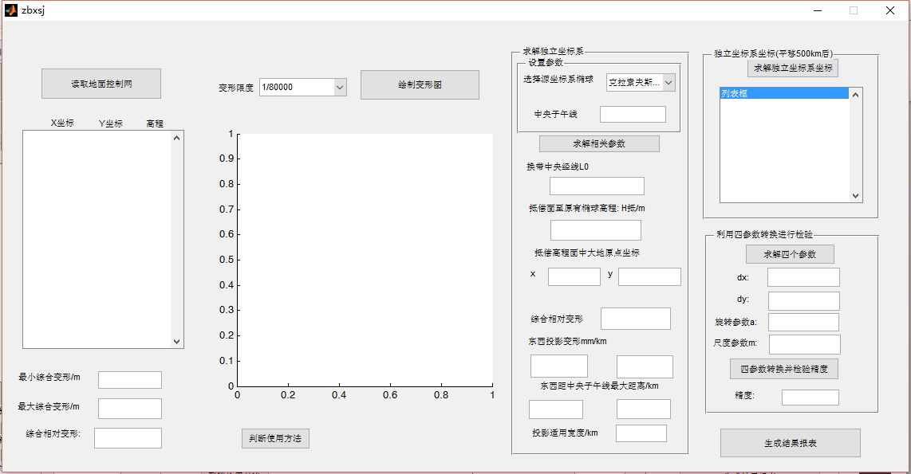
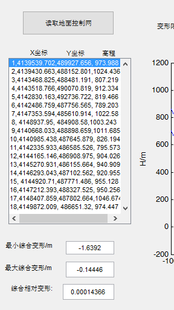
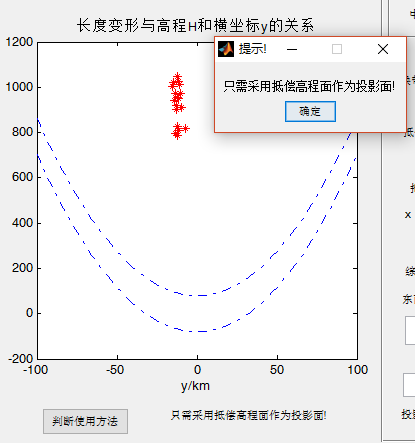
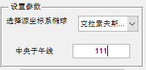
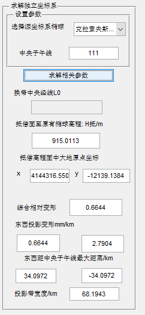
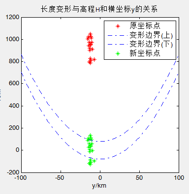
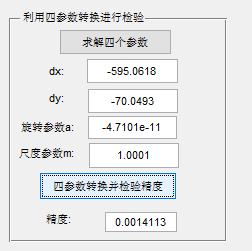
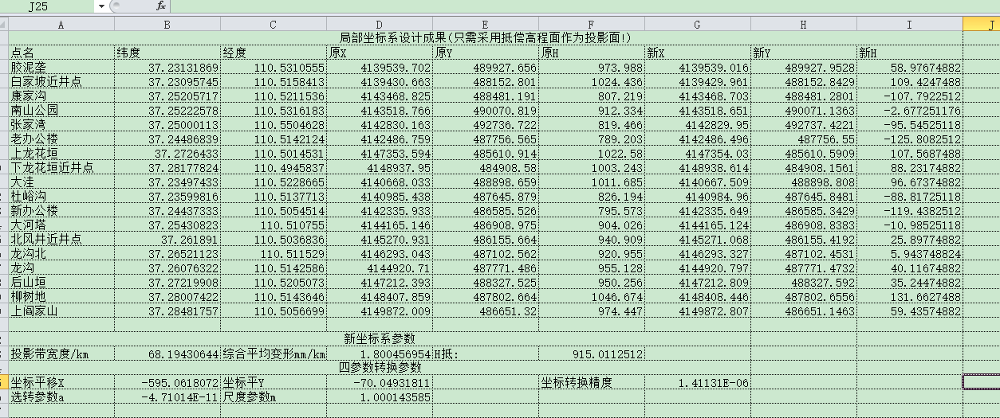

# 独立坐标系设计  
为了方便一个国家的地形测绘，以及军事上的需求和工程需求，必须建立一个统一的国家的坐标系统。在工程建设中，有时候使用国家坐标系会导致精度不满足工程建设的要求，因而需要建立一个独立坐标系统。
常用到的坐标系： 

    

实际的城市工程（或矿山）控制网采用国家统一坐标系统时，常因国家控制网的投影带太宽，以致控制网各边的真实长度常被改变，引起长度的变形，这对于工程或矿山的大比例尺地形测图和工程测量是十分不利的。为了有效地控制投影长度变形，就需要分析长度变形的来源和容许值，以及国家统一坐标系统的适用程度和范围，设计工程或矿山坐标系统，以期抵偿长度变形的影响。  

-------------------

程序设计流程框图

    

GUI界面为：

    

 

以地面控制网数据为例    
（1）	读入数据，并求出当前平均相对变形    
（2）	下拉菜单选择相对变形值1：80000  

    

（3）	判断独立坐标设计方案

    

（4）	选择高斯反算参数（54北京使用克拉索夫斯基椭球，中央经度为111

    

（5）	求解相关参数（H抵，平均长度综合变形，投影带宽度等等）

    

（6）	进行坐标转换并绘制图形

    

（7）	利用四参数模型，求解直接转换系数以及转换经度。

    

（8）	生成结果报表。

    

